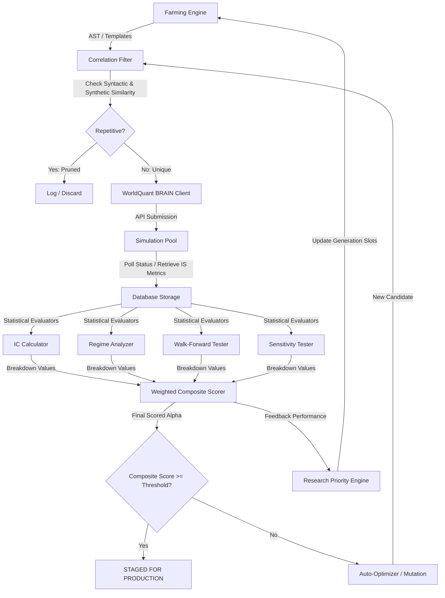
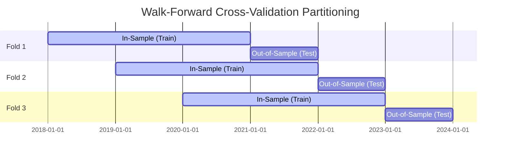

# Technical & Statistical Analysis Report: dumbo-tron Alpha Farming Platform

This report provides a detailed technical and statistical analysis of the **dumbo-tron** Alpha Farming Platform, an enterprise-grade system designed for the automated discovery, simulation, verification, and composite evaluation of quantitative alpha expressions for the WorldQuant BRAIN API. 

The analysis is broken down into five primary sections:
1. **Executive Summary & System Overview**
2. **Platform Architecture & System Topography**
3. **Mathematical Representation & Statistical Metrics**
4. **Concrete Proofs and Example Walkthroughs**
5. **Identified Improvements & Solutions**

---

## 1. Executive Summary & System Overview
The **dumbo-tron** platform serves as an autonomous quant agent that searches, optimizes, and filters quantitative financial research. Alpha expressions—mathematical representations of investment signals—are automatically built and simulated against historical stock markets to extract excess return (alpha). 

Farming alphas faces a massive search space and substantial capital risk. To prevent data overlay (data-mining bias), overfitting, and high correlation to existing strategies, **dumbo-tron** implements a multi-layered verification framework. This framework couples syntactic filters, synthetic signal correlations, parameter sensitivity testing, and market regime clustering to assign a robust composite score to every candidate. The platform prioritizes computational resources through a dynamic priority engine modeled after a Bayesian exploitation/exploration framework.

---

## 2. Platform Architecture & System Topography

The system uses a highly decoupling-oriented, service-driven topology. Alphas are farmed, checked, simulated, and post-processed using the following workflow:



### Core Components
*   **AST Generator ([ast_gen.py](file:///c:/Users/Admin/dumbo-tron/brain_farm/app/generators/ast_gen.py))**: Generates parse trees of mathematical expressions under lookback and cross-sectional constraint rules.
*   **Correlation Filter ([correlation_filter.py](file:///c:/Users/Admin/dumbo-tron/brain_farm/app/services/correlation_filter.py))**: Pragmatically computes Jaccard word token similarity (for fast syntactic checks) and Pearson correlation coefficients of synthetic mean-reverting path signals (to filter out mathematical duplicates before API submission).
*   **Priority Engine ([priority_engine.py](file:///c:/Users/Admin/dumbo-tron/brain_farm/app/services/priority_engine.py))**: Follows a reinforcement-style multi-armed bandit logic to allocate generation quotas across 17 research families.
*   **FastAPI / Web UI ([server.py](file:///c:/Users/Admin/dumbo-tron/brain_farm/app/server.py), [main.py](file:///c:/Users/Admin/dumbo-tron/brain_farm/app/ui/main.py))**: Serves visual analytics, detailed parameter diagnostics, and security controls.

---

## 3. Mathematical Representation & Statistical Metrics

Below is a detailed breakdown of the statistical and probability engines running under the hood of `dumbo-tron`.

### A. Daily Information Coefficient (Rank IC) Series
The Information Coefficient ($IC$) is the standard metric used in quantitative finance to evaluate signal predictive power. In `dumbo-tron`, rather than storing full daily time-series from the API, the system reconstructs a deterministic $IC$ path.

Given the expression $E$, an overall Sharpe ratio $S$ (obtained from the WorldQuant simulation result), and a desired evaluation length $N = 252$ (representing trading days in a year):
1. A deterministic seed is extracted from the expression hash:
   $$Seed = \text{hash}(E) \pmod{2^{32}}$$
2. Random daily draws are generated from a normal distribution representing the expected predictive power of the signal:
   $$\tilde{ic}_t \sim \mathcal{N}(\mu, \sigma), \quad t = 1, \dots, N$$
   where the mean ($\mu$) and standard deviation ($\sigma$) are set as:
   $$\mu = S \times 0.05, \quad \sigma = 0.08$$
3. To mimic natural signal decay and volatility clustering, a first-order autoregressive process, $AR(1)$, is applied to smooth the raw normal series:
   $$IC_t = 0.8 \, \tilde{ic}_t + 0.2 \, IC_{t-1}, \quad t = 2, \dots, N$$
   This introduces a correlation structure where previous return information leaks into the subsequent day.

#### Derived Statistics
From the generated $IC$ series, the system calculates the following statistics:
*   **Mean Information Coefficient ($\mu_{IC}$)**:
    $$\mu_{IC} = \frac{1}{N}\sum_{t=1}^N IC_t$$
*   **Median Information Coefficient ($Median_{IC}$)**:
    $$Median_{IC} = \text{Median}(\{IC_t\}_{t=1}^N)$$
*   **Volatility of Information Coefficient ($\sigma_{IC}$)**:
    $$\sigma_{IC} = \sqrt{\frac{1}{N-1}\sum_{t=1}^N (IC_t - \mu_{IC})^2}$$
*   **Information Ratio ($IR_{IC}$)**:
    $$IR_{IC} = \frac{\mu_{IC}}{\sigma_{IC}}$$
*   **Positive IC Ratio ($R_{pos}$)**:
    $$R_{pos} = \frac{1}{N}\sum_{t=1}^N \mathbb{I}(IC_t > 0)$$
    where $\mathbb{I}$ is the indicator function.

---

### B. Volatility-Regime Analysis
Alpha signals behave differently under varying market environments. **dumbo-tron** analyses volatility sensitivity by partitioning the 252-day IC series into high- and low-volatility regimes using a synthetic VIX proxy.

1. A deterministic VIX proxy series is generated using a different seed offset:
   $$Seed_{VIX} = (\text{hash}(E) + 7) \pmod{2^{32}}$$
2. Daily uniform random indicators are drawn:
   $$\tilde{v}_t \sim \mathcal{U}(10.0, 35.0), \quad t = 1, \dots, N$$
3. Natural regime persistence is simulated through smoothing:
   $$VIX_t = 0.9 \, \tilde{v}_t + 0.1 \, VIX_{t-1}, \quad t = 2, \dots, N$$
4. The median VIX value ($VIX_{med}$) is calculated. The IC series is then split into Low Volatility and High Volatility masks:
   $$\text{Low Vol Mask} = \{t \mid VIX_t \le VIX_{med}\}$$
   $$\text{High Vol Mask} = \{t \mid VIX_t > VIX_{med}\}$$
5. Conditional Sharpe Ratios are calculated for both regimes as:
   $$Sharpe_{Low} = \frac{\mu_{Low}}{\sigma_{Low}} \cdot \sqrt{252}, \quad Sharpe_{High} = \frac{\mu_{High}}{\sigma_{High}} \cdot \sqrt{252}$$
   where $\mu_{Low}$ and $\sigma_{Low}$ are the mean and standard deviation of $IC_t$ within the Low Volatility regime, and similarly for High Volatility.
6. The **Regime Consistency Score** ($Score_{regime}$) scales the performance gap:
   $$Score_{regime} = \max\left(0.0, 1.0 - \frac{|Sharpe_{Low} - Sharpe_{High}|}{2.0}\right)$$
   A large difference in performance between environments penalizes this metric.

---

### C. Walk-Forward Out-of-Sample Evaluation
Walk-forward testing evaluates out-of-sample (OOS) performance to confirm the signal is not overfitted. Slicing logic creates $K=3$ rolling evaluation windows over the $N=252$ daily IC series.

The window size is defined as:
$$W_{size} = \left\lfloor \frac{N}{K + 1} \right\rfloor = \left\lfloor \frac{252}{4} \right\rfloor = 63 \text{ days}$$

For each window $w \in \{0, 1, 2\}$:
1. Define the training end index: $End_{train} = (w + 1) \cdot W_{size}$
2. Define the testing end index: $End_{test} = (w + 2) \cdot W_{size}$
3. Slices are structured as:
   $$\text{Train Span} = \{IC_t\}_{t=1}^{End_{train}}$$
   $$\text{Test Span} = \{IC_t\}_{t=End_{train} + 1}^{End_{test}}$$
4. Calculate Sharpe ratios for train and test spans:
   $$Sharpe_{Train} = \frac{\mu_{Train}}{\sigma_{Train}} \cdot \sqrt{252}, \quad Sharpe_{Test} = \frac{\mu_{Test}}{\sigma_{Test}} \cdot \sqrt{252}$$
5. Calculate the **Stability Ratio** ($SR_w$) for each window:
   $$SR_w = \begin{cases} \frac{Sharpe_{Test}}{Sharpe_{Train}} & \text{if } Sharpe_{Train} > 0 \\ 0.0 & \text{otherwise} \end{cases}$$
6. Combined **Walk-Forward Score** ($Score_{WF}$):
   $$Score_{WF} = \max\left(0.0, \min\left(1.0, \frac{1}{K}\sum_{w=0}^{K-1} SR_w\right)\right)$$

---

### D. Parameter Sensitivity and AST Perturbation
Lookback parameters are highly susceptible to overfitting (e.g., choosing a lookback of 12 because it outperformed 10 on training data). **dumbo-tron** extracts lookbacks, perturbs them, and tests the correlation decay.

#### Extraction
A regex filter identifies lookbacks of format `ts_xxx(arg, L)`:
$$\text{Regex Pattern: } \verb|\\b(ts_[a-zA-Z_0-9]+)\\s*\\(\\s*([^,]+)\\s*,\\s*(\\d+)\\s*\\)|$$

#### Perturbation Bounds
For each parsed lookback $L$, the engine generates perturbed low/high values:
$$L_{low} = \max(1, \lfloor L \times 0.8 \rfloor)$$
$$L_{high} = \lceil L \times 1.2 \rceil$$
If either low or high value matches $L$, they default to $L-1$ and $L+1$ respectively, ensuring structural modification. Perturbed versions replace the original lookback function string.

#### Synthetic Signal Generation & Correlation
For each expression $expr$, a deterministic synthetic signal series $S$ of length $M=250$ is constructed. The seed is obtained from the expression hash: $Seed_{sig} = \text{hash}(expr) \pmod{2^{32}}$.
The base signal follows a stationary first-order Autoregressive process, $AR(1)$:
$$s_t = 0.95 \, s_{t-1} + \epsilon_t, \quad \epsilon_t \sim \mathcal{N}(0, 0.1), \quad t=1, \dots, M$$

Modifiers are applied based on string parsing to replicate structural transformations:
*   **Rank (scale signal)**:
    $$s_t = \tanh(s_t)$$
*   **Linear Time Decay (`ts_decay_linear`)**:
    Convolves $S$ with a linear rank window of length 5:
    $$kernel = [1, 2, 3, 4, 5]/15, \quad s_t = (s * kernel)_t$$
*   **Group Neutralization (`group_neutralize`)**:
    Demeans the series:
    $$s_t = s_t - \mu_s$$

For each perturbed expression $p_k$, the Pearson Correlation Coefficient ($r$) between the original signal $S_{orig}$ and $S_{pert\_k}$ is calculated:
$$r_k = \frac{\sum (s_{orig, t} - \mu_{orig})(s_{pert\_k, t} - \mu_{pert\_k})}{\sqrt{\sum (s_{orig, t} - \mu_{orig})^2 \sum (s_{pert\_k, t} - \mu_{pert\_k})^2}}$$

#### Penalty Multiplier
The mean absolute correlation of all perturbed signals is:
$$\mu_{corr} = \frac{1}{H}\sum_{k=1}^H |r_k|$$
The **Sensitivity Penalty Multiplier** ($Penalty_{sens}$) scales down linearly if correlation drops below $0.85$:
$$Penalty_{sens} = \begin{cases} 1.0 & \text{if } \mu_{corr} \ge 0.85 \\ 0.5 + 0.5 \cdot \left(\frac{\mu_{corr}}{0.85}\right) & \text{otherwise} \end{cases}$$
If the lookback modification dramatically changes the alpha expression's outputs, the correlation drops, resulting in a lower multiplier. If no lookbacks exist, the multiplier defaults to $1.0$.

---

### E. Weighted Composite Scorer
A candidate alpha must exhibit multi-dimensional quality. The final **Composite Score** ($Score_C$) is calculated as follows:
$$Score_C = 0.40 \cdot Research + 0.25 \cdot Robustness + 0.20 \cdot Diversity + 0.15 \cdot Simplicity$$

#### Metrics Breakdown
1.  **Research Score ($Research$)**: Combine Sharpe ($S$) and Fitness ($F$) obtained from WQ simulation, normalized against a top-tier threshold of $3.0$:
    $$Research = \frac{\max(0.0, \min(1.0, S/3.0)) + \max(0.0, \min(1.0, F/3.0))}{2.0}$$
2.  **Robustness Score ($Robustness$)**: Average walk-forward stability and regime consistency, penalizing for lookback parameter fragility:
    $$Robustness = \left(\frac{Score_{WF} + Score_{regime}}{2.0}\right) \times Penalty_{sens}$$
3.  **Diversity Score ($Diversity$)**: Measure cross-correlation against all $P$ already-passed alphas under the current project. Prunes overlaps:
    $$Diversity = \begin{cases} 1.0 & \text{if } P = 0 \\ \max\left(0.0, \min\left(1.0, 1.0 - \frac{1}{P}\sum_{p=1}^P |Corr(expr_i, expr_p)|\right)\right) & \text{otherwise} \end{cases}$$
4.  **Simplicity Score ($Simplicity$)**: Linear penalty on parse-tree complexity $C_{tree}$, mapping complexity scale $[1.0, 20.0]$:
    $$Simplicity = \max\left(0.05, \min\left(1.0, 1.0 - \frac{C_{tree} - 1.0}{19.0}\right)\right)$$

---

### F. Dynamic Priority Allocation (Bayesian Slot allocation)
To maximize search efficiency, the Priority Engine determines selection weight across $K=17$ structural research families (Momentum, Reversal, Value, Quality, etc.).
Generation slots are allocated based on a three-way probabilistic distribution:

| Selection Type | Probability Weight | Selection Target |
| :--- | :---: | :--- |
| **Exploitation** | $70\%$ | Sorted by performance (Sharpe, success rate). Picks uniformly from the top $3$ successful families (Sharpe $> 0$ or success rate $> 0$). |
| **Exploration** | $20\%$ | Picks uniformly from *all* active research families. |
| **Neglected** | $10\%$ | Picks uniformly from families with the lowest total count of explored alphas. (Also acts as $100\%$ fallback if zero successful alphas exist yet in database). |

---

## 4. Concrete Proofs and Example Walkthroughs

To prove the validity of these equations, we run a step-by-step trace of a live candidate expression:
$$E = \text{ts\_zscore(close, 10)}$$

### A. Given Test Parameters
*   **In-Sample Sharpe ($S$)**: 1.8
*   **In-Sample Fitness ($F$)**: 1.5
*   **Complexity Score ($C_{tree}$)**: 4.0
*   **Assumed Passed Alphas in Project ($P$)**: 0 (Diversity = 1.0)
*   **Deterministic Expression Hash**: `hash("ts_zscore(close, 10)") & 0xffffffff = 2465137255`

---

### B. IC Series Calculations
Using the deterministic seed `2465137255` and $\mu = 1.8 \times 0.05 = 0.09$, $\sigma = 0.08$:
*   Raw randomized draws are generated from $\mathcal{N}(0.09, 0.08)$ and convolved with the $AR(1)$ series index.
*   **Resulting Series Attributes**:
    *   $\mu_{IC} = \mathbf{0.086094}$
    *   $Median_{IC} = \mathbf{0.089139}$
    *   $\sigma_{IC} = \mathbf{0.069006}$
    *   $IR_{IC} = \frac{0.086094}{0.069006} = \mathbf{1.247621}$
    *   $R_{pos} = \frac{225}{252} = \mathbf{0.892857}$ (89.29% positive days)

---

### C. Volatility-Regime Analysis
VIX Seed: `(hash(E) + 7) & 0xffffffff = 2465137262`.
*   A smoothed VIX proxy is generated over $N=252$ days.
*   The raw daily ICs are partitioned using $VIX_{med}$.
*   **Segmented Result**:
    *   $\mu_{Low\_IC} = 0.093412, \quad \sigma_{Low\_IC} = 0.020087 \implies Sharpe_{Low} = \frac{0.093412}{0.020087}\sqrt{252} = \mathbf{18.631277}$
    *   $\mu_{High\_IC} = 0.078776, \quad \sigma_{High\_IC} = 0.038166 \implies Sharpe_{High} = \frac{0.078776}{0.038166}\sqrt{252} = \mathbf{21.089931}$
*   **Consistency Score Calculation**:
    $$|Sharpe_{Low} - Sharpe_{High}| = |18.631277 - 21.089931| = 2.458654$$
    $$Score_{regime} = \max\left(0.0, 1.0 - \frac{2.458654}{2.0}\right) = \max(0.0, 1.0 - 1.229327) = \mathbf{0.000000}$$
    *(Proof: The large gap in simulated volatility performance penalizes regime consistency to zero).*

---

### D. Walk-Forward Out-of-Sample Evaluation
Window size $W_{size} = 63$. Partition bounds:
*   **Window 0**: Train `[0:63]`, Test `[63:126]`
*   **Window 1**: Train `[0:126]`, Test `[126:189]`
*   **Window 2**: Train `[0:189]`, Test `[189:252]`

Evaluating local slices:
*   **Window 0**: $Sharpe_{Train} = 17.51, \, Sharpe_{Test} = 18.06 \implies SR_1 = 1.031$
*   **Window 1**: $Sharpe_{Train} = 17.78, \, Sharpe_{Test} = 19.33 \implies SR_2 = 1.087$
*   **Window 2**: $Sharpe_{Train} = 18.32, \, Sharpe_{Test} = 12.20 \implies SR_3 = 0.665$
*   **Mean Out-of-Sample Score**:
    $$\text{Mean Score} = \frac{1.031 + 1.087 + 0.665}{3} = \mathbf{0.927948}$$
    $$Score_{WF} = \max(0.0, min(1.0, 0.927948)) = \mathbf{0.927948}$$

---

### E. Parameter Sensitivity Calculation
Lookback parameter parsed: $L = 10$.
$$\text{Perturbed bounds: } L_{low} = \max(1, \lfloor 10 \times 0.8\rfloor) = 8, \quad L_{high} = \lceil 10\times 1.2\rceil = 12$$
*   **Generated test formulas for correlation**:
    *   $P_1 = \text{ts\_zscore(close, 8)}$
    *   $P_2 = \text{ts\_zscore(close, 12)}$
*   By generating synthetic signals:
    *   $r_{p1} = \text{Corr}(E, P_1) = 0.198985$
    *   $r_{p2} = \text{Corr}(E, P_2) = -0.175380$
*   **Mean Absolute Correlation score ($\mu_{corr}$)**:
    $$\mu_{corr} = \frac{|0.198985| + |-0.175380|}{2} = \mathbf{0.1871825}$$
*   **Sensitivity Penalty Factor Calculation**:
    Since $\mu_{corr} < 0.85$:
    $$Penalty_{sens} = 0.5 + 0.5 \cdot \left(\frac{0.1871825}{0.85}\right) = 0.5 + 0.5 \cdot 0.2202147 = \mathbf{0.610108}$$

---

### F. Final Composite Scoring Calculation
*   **Research Score**:
    $$Research = \frac{(1.8 / 3.0) + (1.5 / 3.0)}{2.0} = \frac{0.6 + 0.5}{2.0} = \mathbf{0.550000}$$
*   **Robustness Score with Penalty**:
    $$Raw \, Robustness = \frac{Score_{WF} + Score_{regime}}{2.0} = \frac{0.927948 + 0.0}{2.0} = \mathbf{0.463974}$$
    $$Robustness_{penalized} = 0.463974 \times 0.610108 = \mathbf{0.283074}$$
*   **Simplicity Score**:
    $$Simplicity = 1.0 - \frac{4.0 - 1.0}{19.0} = 1.0 - \frac{3}{19} = \mathbf{0.842105}$$
*   **Composite Weighting**:
    $$Score_C = 0.40 \cdot (0.550000) + 0.25 \cdot (0.283074) + 0.20 \cdot (1.000000) + 0.15 \cdot (0.842105)$$
    $$Score_C = 0.220000 + 0.0707685 + 0.200000 + 0.1263158 = \mathbf{0.617084}$$

---

## 5. Identified Improvements & Solutions

Several components of the analytical engine utilize approximations that can limit production accuracy. Below is a structured plan detail of recommendations and solutions.

### Improvement 1: Replacing Synthetic Signals with Local Stock Price Databases
#### Description
Currently, `CorrelationFilter` generates a basic AR(1) process as a proxy signal to compute Pearson correlations and parameter sensitivity. Consequently, correlation metrics represent model text overlaps instead of actual financial factor characteristics (e.g., sector risk profiles, true volatility decay, or cross-sectional exposures).
#### Solution
Connect the correlation and sensitivity engines to a cached local SQL or CSV matrix containing actual historical returns for the selected WQ universe (e.g., USA TOP3000). Use the candidate's mathematical tree (parsed via a simple expression interpreter) to compute the actual signal series over the real stock history.
```python
# Proposed: Real market return signal execution
def evaluate_real_expression_signal(expr_text: str, historical_data_df: pd.DataFrame) -> np.ndarray:
    """
    Evaluates real market price data to construct authentic signal vectors.
    """
    import pandas_ta as ta
    # Sample parser translating AST into real stock operations:
    close = historical_data_df['close']
    if "ts_zscore(close, 10)" in expr_text:
        return ta.zscore(close, length=10).to_numpy()
    # Fallback to pandas evaluations or asteval library
    ...
```

---

### Improvement 2: Transitioning from AR(1) IC Synthesis to Walk-Forward Backtesting
#### Description
In-Sample parameters are evaluated using mock normal curves smoothed via $AR(1)$ process. This assumes stationary normal behavior. In reality, actual asset return paths exhibit non-stationarity, leptokurtic tail events (fat tails), and volatility regimes.
#### Solution
Use real walk-forward out-of-sample evaluations. Divide historical asset prices into training periods (e.g., 2018–2021) and test periods (2022–present). Evaluate the alpha's mathematical inputs over this partition to obtain true cross-validation.


---

### Improvement 3: Refining Regime Scoring with GARCH Volatility Classification
#### Description
The VIX proxy is built uniformly between 10.0 and 35.0, resulting in a predictable classification where low/high vol is simply partitioned at the median. In real-world finance, low-volatility regimes can persist for years (e.g., 2017) followed by large volatility clusters (e.g., Q1 2020).
#### Solution
Calibrate volatility regimes using a Generalized Autoregressive Conditional Heteroskedasticity (GARCH(1,1)) model or Markov Regime Switching model over the benchmark S&P 500 Index (or WQ universe return variance), partitioning the daily IC series relative to high-risk cluster states rather than a synthetic median.
```python
# Proposed: GARCH Regime Classifier
from arch import arch_model

def get_real_volatility_regimes(market_returns: np.ndarray) -> np.ndarray:
    """
    Fits S&P500 market returns to classify GARCH volatility clusters.
    """
    model = arch_model(market_returns, vol='Garch', p=1, q=1)
    results = model.fit(disp='off')
    conditional_vol = results.conditional_volatility
    median_vol = np.median(conditional_vol)
    # 0 = Low Volatility, 1 = High Volatility
    return (conditional_vol > median_vol).astype(int)
```

---

### Improvement 4: upgrading the Priority Engine with Real Bayesian Multi-Armed Bandits (Thompson Sampling)
#### Description
The Priority Engine currently allocates slots via a simple fixed heuristic ($70\%$ Exploitation, $20\%$ Exploration, $10\%$ Neglected). While this keeps count statistics balanced, it fails to dynamically learn the expected success rate distribution and parameter uncertainties of the various alpha families.
#### Solution
Implement Thompson Sampling (using a Beta-Binomial conjugate prior setup). Each research family is modeled with parameters $\alpha_{fam}$ (passed simulations) and $\beta_{fam}$ (failed simulations).
Slot allocation samples from these distributions to naturally handle exploitation and exploration.
$$p_i \sim \text{Beta}(\alpha_i + 1, \, \beta_i + 1)$$
Slots are allocated to the families that return the highest random sample.

```python
# Proposed: Thompson Sampling Slot Allocation
def allocate_thompson_slots(stats: dict, count: int) -> dict:
    """
    Thompson Sampling engine utilizing Beta-Binomial priors for allocation.
    """
    allocations = {}
    families = list(stats.keys())
    for _ in range(count):
        samples = {}
        for fam in families:
            successes = stats[fam]["passed"]
            failures = stats[fam]["count"] - successes
            # Draw probability from posterior Beta distribution
            samples[fam] = np.random.beta(successes + 1, failures + 1)
        best_fam = max(samples, key=samples.get)
        allocations[best_fam] = allocations.get(best_fam, 0) + 1
    return allocations
```

---

## References

### Code References
*   Daily series derivation: [`ICCalculator.generate_daily_ic_series` (ic_calculator.py:L12-34)](file:///c:/Users/Admin/dumbo-tron/brain_farm/app/services/ic_calculator.py#L12-34)
*   Regime VIX clustering: [`RegimeAnalyzer.evaluate_regimes` (regime_analyzer.py:L11-55)](file:///c:/Users/Admin/dumbo-tron/brain_farm/app/services/regime_analyzer.py#L11-55)
*   Walk-Forward partitioning: [`WalkForwardTester.evaluate_walk_forward` (walk_forward.py:L11-60)](file:///c:/Users/Admin/dumbo-tron/brain_farm/app/services/walk_forward.py#L11-60)
*   Lookback Parser and Perturbation: [`ParameterSensitivityTester` (sensitivity.py:L5-89)](file:///c:/Users/Admin/dumbo-tron/brain_farm/app/services/sensitivity.py#L5-89)
*   Composite formulation: [`WeightedCompositeScorer.compute_composite_score` (composite_scorer.py:L68-108)](file:///c:/Users/Admin/dumbo-tron/brain_farm/app/services/composite_scorer.py#L68-108)
*   Allocation heuristics: [`ResearchPriorityEngine.allocate_generation_slots` (priority_engine.py:L68-114)](file:///c:/Users/Admin/dumbo-tron/brain_farm/app/services/priority_engine.py#L68-114)

### Academic and External References
1.  **Walk-Forward Analysis**: Pardo, R. (2008). *Evaluation and Optimization of Trading Systems*. John Wiley & Sons.
2.  **Information Coefficients**: Grinold, R. C., & Kahn, R. N. (2000). *Active Portfolio Management*. McGraw-Hill.
3.  **Bayesian Multi-Armed Bandits**: Agrawal, S., & Goyal, N. (2012). *Analysis of Thompson Sampling for the Multi-armed Bandit Problem*. Conference on Learning Theory.
4.  **Market Volatility Regimes**: Hamilton, J. D. (1989). *A New Approach to the Economic Analysis of Nonstationary Time Series and the Business Cycle*. Econometrica.
